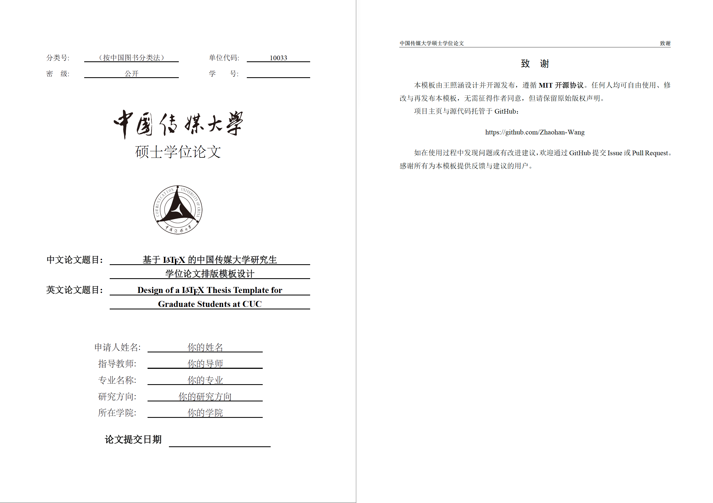
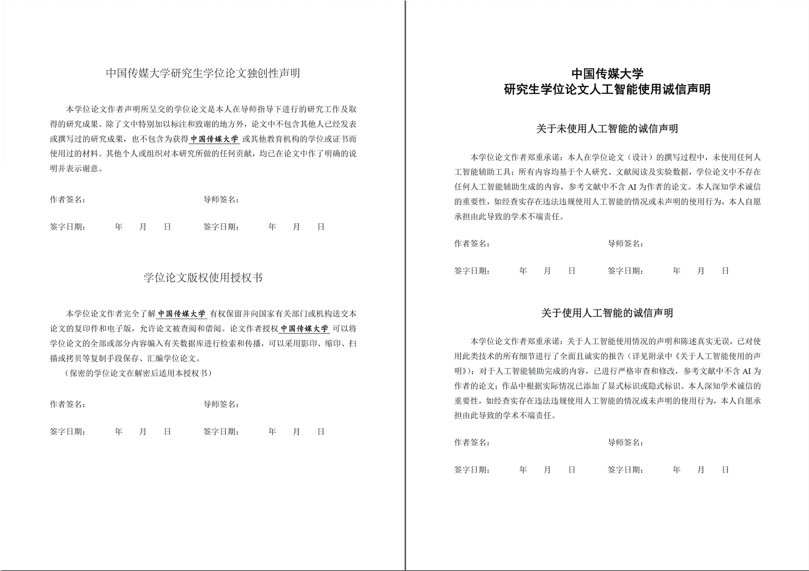
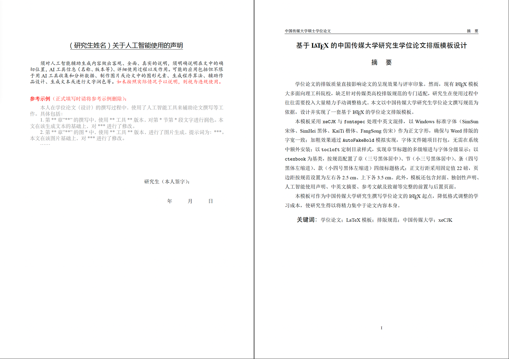
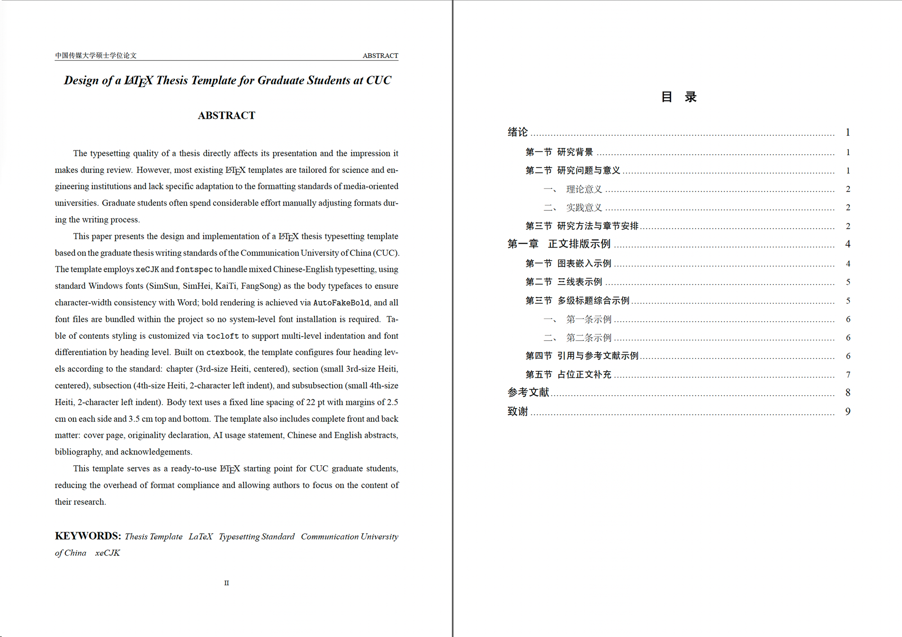
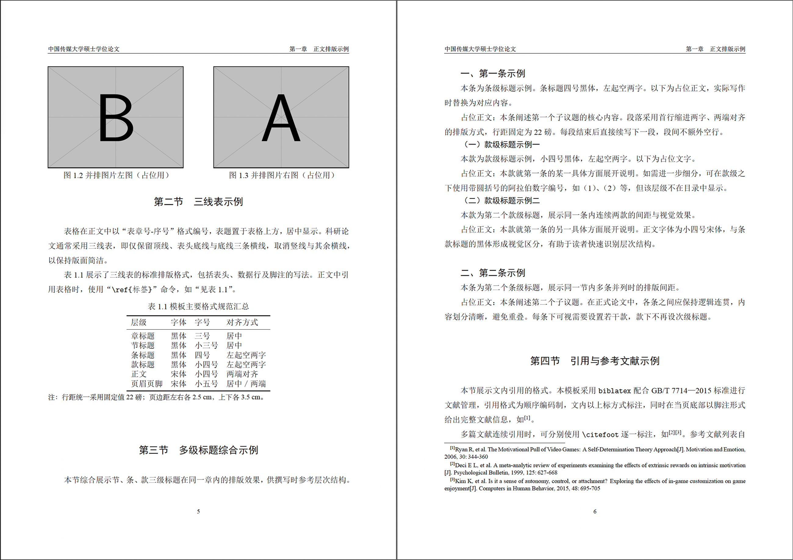

# CUCThesis —— 中国传媒大学研究生学位论文 LaTeX 模板（人文社会科学版，非官方）

[](https://opensource.org/licenses/MIT)

本模板基于中国传媒大学研究生院发布的《研究生学位论文编写规则（人文社会科学版）》（2025 年 10 月版）制作，为**人文社会科学**方向的硕士、博士研究生提供符合规范的 LaTeX 写作框架。

> 本模板在设计过程中参考了以下前人工作，在此一并致谢：
> - [TheoCUC/CUC-LaTeX-Templates](https://github.com/TheoCUC/CUC-LaTeX-Templates) —— 中国传媒大学非官方 LaTeX 模板合集
> - [TheoCUC/LaTeX_CUC](https://github.com/TheoCUC/LaTeX_CUC) —— 中国传媒大学非官方 LaTeX 论文模板
> - [cucJ2014/CUC_Template-of-thesis_Latex](https://github.com/cucJ2014/CUC_Template-of-thesis_Latex) —— 中国传媒大学论文模板 LaTeX
> - [AmnesiaBeing/CUC-Thesis-Template](https://github.com/AmnesiaBeing/CUC-Thesis-Template) —— 中国传媒大学工科研究生毕业论文 LaTeX 模板

---

## 主要特性

- 封面、独创性声明、人工智能使用声明页自动生成
- 中英文摘要、目录、参考文献、致谢等完整前后置结构
- 四级标题格式（章 / 节 / 条 / 款）符合人文社科版规范
- 行距固定 22 磅，页边距左右 2.5 cm、上下 3.5 cm
- 使用 Windows 标准中文字体（SimSun / SimHei / KaiTi / FangSong），字体文件随项目打包，无需额外安装
- 参考文献采用 GB/T 7714—2015 顺序编码制，支持文末列表与当页脚注双重标注（`\citefoot`）
- 图表示例：单图、两图并排、三线表
- 一键编译脚本（`编译论文.command`，macOS 双击运行）

---

## 效果预览

| |
|:---:|
|  |
| 封面 |

| | |
|:---:|:---:|
|  |  |
| 独创性声明及 AI 使用声明 | 摘要 |
|  |  |
| 目录 | 正文排版 |

---

## 快速开始

### 环境要求

- [MacTeX](https://www.tug.org/mactex/)（macOS）或 TeX Live（Windows / Linux）
- 编译引擎：**XeLaTeX** + **Biber**

### 编译方式

**方法一：双击脚本（macOS）**

直接双击 `编译论文.command`，自动完成完整编译流程（xelatex → biber → xelatex × 2）。

**方法二：命令行**

```bash
xelatex paper
biber paper
xelatex paper
xelatex paper
```

### 文件结构

```
.
├── CUCThesis.cls          # 文档类（核心样式）
├── paper.tex              # 主文件（论文参数在此填写）
├── ref.bib                # 参考文献数据库
├── 编译论文.command        # 一键编译脚本（macOS）
├── data/
│   ├── abstract.tex       # 中英文摘要
│   ├── chapter1.tex       # 第一章（绪论示例）
│   ├── chapter2.tex       # 第二章（排版示例）
│   ├── acknowledgements.tex
│   └── appendix.tex
├── figures/               # 图片文件
├── fonts/                 # 字体文件（随项目打包）
│   ├── SimSun.ttc
│   ├── SimHei.ttf
│   ├── Kaiti.ttf
│   └── FangSong.ttf
└── coverimg/              # 封面校名、校徽图片
```

---

## 使用说明

1. 在 `paper.tex` 顶部的 `\setup{}` 中填写论文题目、作者、导师、学院、专业等信息
2. 在 `data/` 目录下各文件中撰写正文内容
3. 在 `ref.bib` 中管理参考文献
4. 正文引用请使用 `\citefoot{key}`（同时产生上标编号和当页脚注）

---

## ⚠️ 免责声明

- **本模板未经中国传媒大学官方授权**，属个人制作的非官方模板，与中国传媒大学研究生院无任何隶属关系。
- 本模板依据《研究生学位论文编写规则（人文社会科学版）》（2025 年 10 月版）制作，但 LaTeX 与 Word 在排版细节上存在客观差异，**无法保证与官方 Word 模板完全一致**。
- 论文规范文件本身可能存在前后不一致的情况，使用前请**自行仔细阅读最新版规范原文**，并咨询导师及学院意见。
- **因使用本模板导致的任何格式审查问题，作者概不负责。** 最终提交前请确认所在学院对 LaTeX 格式论文的接受情况，部分学院可能仍要求提交 Word 版本。

---

## 开源协议

本项目遵循 [MIT License](LICENSE) 开源协议。您可以自由使用、修改与再发布本模板，无需征得作者同意，但请保留原始版权声明。

